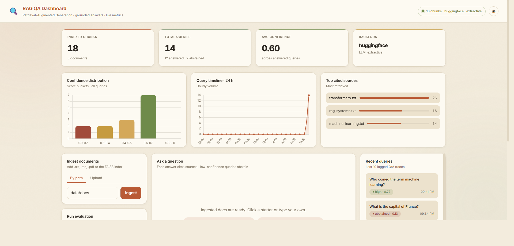

# RAG-Based AI QA System

A production-ready Retrieval-Augmented Generation (RAG) system: ingest
documents, ask questions in natural language, get grounded answers with
source attribution and a built-in hallucination guard. Backed by FAISS,
HuggingFace embeddings, and an async FastAPI service.

---

## What this is for a demo

When someone asks *"show me the output"*, run:

```bash
python run.py serve
```

…then open **http://localhost:8000/** in a browser. The bundled web UI
lets you (1) ingest documents, (2) ask questions in a chat-style panel
that shows the answer, confidence badge, and expandable sources, and
(3) run evaluation with one click — all backed by the same FastAPI
endpoints. No separate frontend build, no Node, no Docker.

## Highlights

- **Web UI included** (`frontend/`) — single-page, vanilla HTML/CSS/JS,
  served by FastAPI itself at `/`. Drop-and-drop upload, chat-style Q&A
  with source cards, one-click evaluation panel.
- **Full pipeline**: ingestion → recursive chunking → embeddings → FAISS
  → top-k retrieval → strict-prompt generation.
- **Hallucination reduction (3 layers)**:
  1. retrieval confidence threshold — abstains *before* calling the LLM,
  2. strict system prompt — forces "I don't know" when context lacks the answer,
  3. source attribution — every answer ships with chunk IDs, paths, scores.
- **Evaluation framework**: exact match, semantic similarity (cosine on
  sentence-transformer embeddings), retrieval accuracy@k. Results stored
  as timestamped JSON.
- **Async FastAPI**: `POST /ingest`, `POST /ingest/upload`, `POST /query`,
  `POST /evaluate`, `GET /health`. CPU-bound work is dispatched via
  `asyncio.to_thread` so the event loop stays responsive.
- **Pluggable backends**: HuggingFace (default, no key) or OpenAI for
  embeddings; extractive (no LLM) or OpenAI for generation.
- **Configurable**: chunk size, overlap, top-k, threshold, backends —
  all env-driven via `.env`.
- **Logging**: human-readable rotating log + machine-readable JSONL of
  every Q/A pair (`storage/logs/queries.jsonl`).

---

## Architecture

```
┌──────────────────────────────────────────────────────────────────┐
│                       FastAPI (async)                             │
│  POST /ingest · POST /query · POST /evaluate · GET /health        │
└──────────┬─────────────────────────────────────┬─────────────────┘
           │                                     │
           ▼                                     ▼
   ┌──────────────┐                  ┌────────────────────┐
   │  Ingestion   │                  │  RAG Orchestrator  │
   └──────┬───────┘                  └──────┬─────────────┘
          │ load → chunk → embed → upsert   │ embed → retrieve → guard → generate
          ▼                                 ▼
   ┌──────────────────────────────────────────────────────┐
   │ ingestion · chunking · embeddings · vector_store     │
   │ retriever · generator · rag (orchestrator)           │
   └──────────────────────────────────────────────────────┘
```

Module map:

| Layer            | File                              | Responsibility                                      |
|------------------|-----------------------------------|-----------------------------------------------------|
| API              | `app/main.py`                     | FastAPI endpoints, async dispatch                   |
| Schemas          | `app/schemas.py`                  | Request/response Pydantic models                    |
| Config           | `app/config.py`                   | Env-driven settings (`.env`)                        |
| Logging          | `app/logger.py`                   | Rotating log + JSONL Q/A trace                      |
| Ingestion        | `app/pipeline/ingestion.py`       | Loads `.txt` / `.md` / `.pdf`                       |
| Chunking         | `app/pipeline/chunking.py`        | Recursive character splitter                        |
| Embeddings       | `app/pipeline/embeddings.py`      | HuggingFace / OpenAI behind a Protocol              |
| Vector store     | `app/pipeline/vector_store.py`    | FAISS `IndexFlatIP` + on-disk persistence           |
| Retriever        | `app/pipeline/retriever.py`       | Top-k + confidence gate                             |
| Generator        | `app/pipeline/generator.py`       | Strict-prompt OpenAI / extractive fallback          |
| Orchestrator     | `app/pipeline/rag.py`             | Composition root + thread-safe singleton            |
| Eval metrics     | `app/evaluation/metrics.py`       | EM, semantic sim, retrieval@k                       |
| Eval runner      | `app/evaluation/evaluator.py`     | Runs QA file, persists JSON results                 |
| CLI              | `run.py`                          | `ingest`, `query`, `evaluate`, `serve`              |

---

## Setup

```bash
# 1. Create a virtual environment
python -m venv .venv
# Windows
.venv\Scripts\activate
# macOS / Linux
source .venv/bin/activate

# 2. Install dependencies
pip install -r requirements.txt

# 3. (Optional) Configure environment
cp .env.example .env
# Edit .env to switch backends, change chunking/retrieval knobs,
# or add OPENAI_API_KEY.
```

The default config requires **no API keys**: it runs locally with
`sentence-transformers/all-MiniLM-L6-v2` for embeddings and the
extractive generator.

---

## Usage

### CLI

```bash
# Ingest the bundled example docs
python run.py ingest data/docs

# Ask a question
python run.py query "How does RAG reduce hallucination?"

# Tune retrieval at the call site
python run.py query "What is self-attention?" --top-k 5 --threshold 0.4

# Evaluate against the bundled QA file
python run.py evaluate

# Run the API
python run.py serve --reload
```

### Web UI (recommended for demos)

```bash
python run.py serve
# open http://localhost:8000/
```

Three panels:
1. **Ingest** — paste a path (`data/docs`) or drag-and-drop files.
2. **Ask** — chat-style. Each answer shows a confidence badge
   (high / moderate / low) and an expandable list of source chunks
   with paths and scores. Out-of-domain questions display the
   *"I don't know based on the provided context"* abstention.
3. **Evaluate** — runs `data/eval/qa_pairs.json` end-to-end and
   displays exact match / semantic similarity / retrieval@k / answered.

The header pill shows live status (index size, embedding/LLM backend).

### HTTP API

Start the server:

```bash
python run.py serve --host 0.0.0.0 --port 8000
# Web UI:        http://localhost:8000/
# OpenAPI docs:  http://localhost:8000/docs
```

**Ingest by path** (files or directories):
```bash
curl -X POST http://localhost:8000/ingest \
  -H "Content-Type: application/json" \
  -d '{"paths": ["data/docs"]}'
```

**Ingest via upload**:
```bash
curl -X POST http://localhost:8000/ingest/upload \
  -F "files=@data/docs/transformers.txt" \
  -F "files=@data/docs/rag_systems.txt"
```

**Query**:
```bash
curl -X POST http://localhost:8000/query \
  -H "Content-Type: application/json" \
  -d '{"question": "What is multi-head attention?", "top_k": 4}'
```

Example response:
```json
{
  "question": "What is multi-head attention?",
  "answer": "Multi-head attention runs multiple attention heads in parallel, each focusing on different aspects of the input; outputs are concatenated and projected back to the model dimension. [#1]",
  "confident": true,
  "confidence_score": 0.69,
  "sources": [
    {
      "rank": 1,
      "score": 0.69,
      "source": "data/docs/transformers.txt",
      "chunk_id": "…",
      "snippet": "Multi-Head Attention. Instead of performing a single attention function …"
    }
  ],
  "metadata": {
    "embedding_backend": "huggingface",
    "llm_backend": "extractive",
    "top_k": 4,
    "score_threshold": 0.30,
    "index_size": 24
  }
}
```

**Evaluate**:
```bash
curl -X POST http://localhost:8000/evaluate \
  -H "Content-Type: application/json" \
  -d '{"qa_path": "data/eval/qa_pairs.json"}'
```

---

## Configuration reference

All settings come from `.env` (see `.env.example`):

| Key                     | Default                                      | Notes                                                        |
|-------------------------|----------------------------------------------|--------------------------------------------------------------|
| `EMBEDDING_BACKEND`     | `huggingface`                                | `huggingface` or `openai`                                    |
| `HF_EMBEDDING_MODEL`    | `sentence-transformers/all-MiniLM-L6-v2`     | Any sentence-transformers model                              |
| `OPENAI_EMBEDDING_MODEL`| `text-embedding-3-small`                     | Used when `EMBEDDING_BACKEND=openai`                         |
| `LLM_BACKEND`           | `extractive`                                 | `extractive` (no LLM) or `openai`                            |
| `OPENAI_CHAT_MODEL`     | `gpt-4o-mini`                                | OpenAI chat model                                            |
| `OPENAI_API_KEY`        | *(empty)*                                    | Required only if `*_BACKEND=openai`                          |
| `CHUNK_SIZE`            | `500`                                        | Characters per chunk                                         |
| `CHUNK_OVERLAP`         | `100`                                        | Overlap between adjacent chunks                              |
| `TOP_K`                 | `4`                                          | Default top-k for retrieval                                  |
| `SCORE_THRESHOLD`       | `0.30`                                       | Cosine threshold; below → "I don't know"                     |
| `INDEX_DIR`             | `storage/faiss_index`                        | Where the FAISS index is persisted                           |
| `LOG_DIR`               | `storage/logs`                               | App log + JSONL Q/A trace                                    |
| `EVAL_DIR`              | `storage/eval_results`                       | Per-run evaluation JSON                                      |

Both `top_k` and `score_threshold` can also be overridden per request.

---

## Hallucination reduction — how it works

1. **Retrieval guard.** After FAISS search, if the top similarity score
   is below `SCORE_THRESHOLD`, the orchestrator returns
   *"I don't know based on the provided context."* without ever calling
   the LLM. This catches out-of-domain questions cheaply and
   deterministically.
2. **Strict prompt.** The generator's system prompt explicitly forbids
   answering from outside context, requires `[#i]` citations, and tells
   the model to say "I don't know" when the context is insufficient.
   `temperature=0.0` removes generation noise.
3. **Source attribution.** Every response carries a `sources` array
   (rank, score, source path, chunk ID, snippet). The user can verify
   any claim against the actual passage.

---

## Evaluation framework

`POST /evaluate` (or `python run.py evaluate`) runs a JSON list of
`{question, answer, source?}` items end-to-end and emits:

- **Exact Match** — normalized string equality between prediction and
  reference. Brittle but unambiguous.
- **Semantic similarity** — cosine similarity between embedding of the
  prediction and the reference. The right metric for paraphrased
  free-form answers.
- **Retrieval accuracy@k** — was the expected source surfaced (or did
  the reference text appear in any retrieved chunk)? Isolates retrieval
  errors from generation errors.
- **Answered rate** — fraction of questions where the system did *not*
  abstain. Useful for tracking the precision/recall tradeoff of the
  abstention threshold.

Aggregate + per-question rows are persisted at
`storage/eval_results/eval-<UTC-timestamp>.json` so you can diff runs
across model / chunk-size / threshold changes.

---

## Sample queries

See `examples/sample_queries.md` for in-domain, multi-document, and
out-of-domain examples with expected outputs.

---

## Tests

```bash
pip install pytest
python -m pytest tests -q                    # fast unit tests
python -m pytest tests -q -m slow            # full pipeline (loads HF model)
```

---

## Project layout

```
RAG-Based AI QA System/
├── app/
│   ├── __init__.py
│   ├── config.py              # env-driven settings
│   ├── logger.py              # rotating log + JSONL trace
│   ├── main.py                # FastAPI app + frontend mount
│   ├── schemas.py             # request/response models
│   ├── pipeline/
│   │   ├── ingestion.py
│   │   ├── chunking.py
│   │   ├── embeddings.py
│   │   ├── vector_store.py
│   │   ├── retriever.py
│   │   ├── generator.py
│   │   └── rag.py
│   └── evaluation/
│       ├── metrics.py
│       └── evaluator.py
├── frontend/                  # served by FastAPI at /
│   ├── index.html
│   ├── styles.css
│   └── app.js
├── data/
│   ├── docs/                  # example dataset
│   └── eval/qa_pairs.json     # example eval set
├── storage/                   # generated at runtime
│   ├── faiss_index/
│   ├── logs/
│   └── eval_results/
├── examples/sample_queries.md
├── tests/test_pipeline.py
├── run.py                     # CLI
├── requirements.txt
├── .env.example
└── README.md
```

---

## Production deployment

### Docker

A multi-stage `Dockerfile` is included. The runtime image is `python:3.12-slim`,
runs as a non-root user, and ships with a built-in `HEALTHCHECK` against
`/health`.

```bash
# Build + run with persistent storage (FAISS index, logs, eval results)
docker compose up --build

# Then open
#   UI:     http://localhost:8000/
#   docs:   http://localhost:8000/docs
#   health: http://localhost:8000/health
```

The compose file mounts:
- `./data` → `/app/data` (read-only) — your source docs.
- `rag-storage` (named volume) → `/app/storage` — persists the FAISS
  index, query traces, and eval outputs across container restarts.

Override any setting via env vars (or a `.env` file in the same dir as
`docker-compose.yml`):

```bash
EMBEDDING_BACKEND=openai LLM_BACKEND=openai OPENAI_API_KEY=sk-... docker compose up
```

### Production hardening checklist

- **Set `AUTO_INGEST_ON_STARTUP=false`** in production. The Docker
  image already defaults to false; auto-ingest is a demo convenience.
- **Restrict `CORS_ORIGINS`** from `*` to your real frontend host(s).
- **Run multiple workers** behind a load balancer:
  `uvicorn app.main:app --workers 4 --host 0.0.0.0 --port 8000`.
  The FAISS index is per-process; if multiple workers ingest, run a
  single ingestion worker or use a shared store (Redis-backed FAISS,
  Milvus, etc.).
- **Persist `storage/`** to durable disk — the FAISS index and JSONL
  trace live there.
- **Front the service with TLS** (nginx, Caddy, an ALB) — uvicorn alone
  shouldn't terminate TLS in production.
- **Forward `storage/logs/queries.jsonl`** to Loki / Datadog / ELK for
  retrieval-quality and abstention-rate analytics.
- **Idempotent ingestion**: chunk IDs are deterministic (`uuid5` of
  `source path + chunk index`), so re-ingesting the same files is a
  no-op rather than a duplicate-and-bloat.

### Architectural notes

- **Index scale.** `IndexFlatIP` gives exact cosine search up to ~1M
  chunks comfortably. Beyond that, swap in `IndexIVFFlat` or `IndexHNSW`
  — the `FaissVectorStore` boundary is the only file you'd touch.
- **Concurrency.** The pipeline singleton is constructed once at
  startup; per-request work runs in a thread pool. Index *writes*
  (ingestion) take a process-local lock to keep FAISS internals safe.
- **Observability.** Every Q/A is logged as a single JSONL line with
  scores and source IDs. Every HTTP request gets an `x-request-id`
  header for tracing.
- **Backend swap.** Set `EMBEDDING_BACKEND=openai` and/or
  `LLM_BACKEND=openai` plus `OPENAI_API_KEY` to upgrade quality without
  changing any code. The first ingestion after switching embedders
  rebuilds the FAISS index automatically (dim mismatch is detected).

---

## Screenshots




